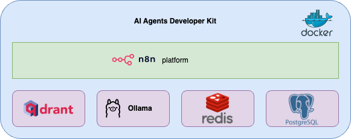

# ai-agents-dev-kit
This is a self hosting repository for creating AI Agents and AI Agent powered workflows using n8n, qdrant, ollama, postgres and redis

### Architecture

### How to run
- `git clone <repo>`
- `cd <repo>`
- `sh setup.sh`

### What all gets installed as part of devkit?

- ✨&nbsp; n8n platform
- ✨&nbsp; Qdrant version 1.13 (latest)
- ✨&nbsp; Ollama with llama3.2: latest installed
- ✨&nbsp; Redis stack for fully function redis cache
- ✨&nbsp; PostgreSQL for maintaining n8n state, data and configuration

### What all you can use this platform for ?
- 🌟&nbsp; Intelligent AI Agents
- 🌟&nbsp; Intelligent Workflow management
- 🌟&nbsp; Intelligent RAG pipeline Agents
- 🌟&nbsp; Intelligent social media Agents
- 🌟&nbsp; much more
